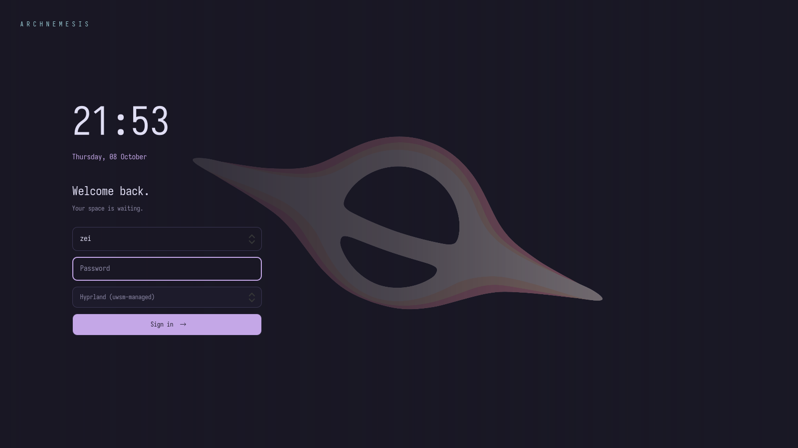

# ARCHNEMESIS

SDDM Qt 6 theme matched to the local Hyprland, Waybar, Kitty and Hyprlock configuration: Rosé Pine, Iosevka Nerd Font Mono, 10px corners and the current black-hole wallpaper. The wallpaper is copied into the theme so the greeter does not need home-directory access. Wallpaper rights remain with its original creator.



## Preview and install

Run `./preview.sh` for SDDM test mode (no real authentication or power actions).
Run `./install.sh --dry-run` to inspect the changes without writing files.
Run `./install.sh` to install and select the theme; sudo requests your password.
No service is restarted. The theme appears when SDDM next starts.
The installer prints a backup location and a rollback command. Backups include the previous theme files, the theme drop-in, and the main SDDM configuration when present. Failed installation restores the snapshot automatically. It does not enable or switch display managers.

For packaging tests, `./install.sh --destdir /absolute/staging/path` writes into a staging tree without sudo or greeter dependency checks. The printed rollback command uses the same staging tree. The repository root installer exposes the same installation as the optional SDDM module (`--only sddm`), including dependency installation with `--install-packages`.

Requires SDDM with sddm-greeter-qt6, Qt Quick and Qt Quick Controls Basic. On Arch Linux, install `sddm qt6-declarative ttf-iosevka-nerd python` with pacman. Install the font system-wide so the greeter can use it. `QtVersion=6` in metadata selects the correct greeter.

## Usage

Usernames are read from SDDM’s `userModel`; none are hardcoded. Choose an account from the user dropdown, then enter the password and select a desktop session. The last signed-in account is preselected; otherwise the first available account is selected. Switching accounts clears the password. Enter submits the password; Tab navigates controls. Failed login clears the password and restores focus. Caps Lock is indicated. Suspend, restart and power-off buttons appear when SDDM reports support; restart and power-off ask for confirmation.

Edit `theme.conf` to change the palette, font or wallpaper, then rerun the installer. The default session is SDDM's last session; the picker also exposes the other installed sessions.

SDDM API reference: https://github.com/sddm/sddm/blob/develop/docs/THEMING.md

## Verification

Rendered with the real Qt 6 greeter in test mode at 1600×900 and 1024×600. Qt Quick tests cover user selection and account-switch password clearing, session forwarding, duplicate submission prevention, failed-login recovery and password clearing on success. Real PAM authentication and power actions were not exercised.

Run tests with:
```sh
QT_QPA_PLATFORM=offscreen QT_QUICK_BACKEND=software /usr/lib/qt6/bin/qmltestrunner -input ./tests
```
